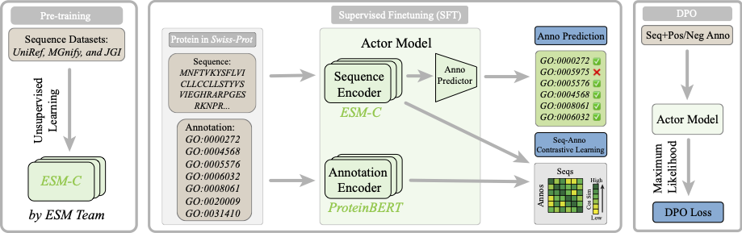

# AnnoDPO

Implementation of [AnnoDPO: Protein Functional Annotation Learning with Direct Preference Optimization](https://arxiv.org/abs/2506.07035) by Zixuan Jiang and Renjing Xu. Please feel free to reach out to us at [zjiang597@connect.hkust-gz.edu.cn](zjiang597@connect.hkust-gz.edu.cn) with any questions.

## Introduction

Deciphering protein function remains a fundamental challenge in protein representation learning. The task presents significant difficulties for protein language models due to the sheer volume of functional annotation categories and the highly imbalanced distribution of annotated instances across biological ontologies. Inspired by the remarkable success of reinforcement learning from human feedback (RLHF) in large language model alignment, we propose AnnoDPO, a novel multi-modal framework for protein function prediction that leverages Direct Preference Optimization (DPO) to enhance annotation learning. 

## Environment

To set up the environment and run our code, you could use the commands below in the terminal:

First clone this repo

~~~
git clone https://github.com/AzusaXuan/AnnoDPO.git
~~~

Then,

~~~
cd AnnoDPO
~~~

Use following commands to set up the environment

~~~
conda create -n annodpo_env python=3.9
conda activate annodpo_env
pip3 install -r requirements.txt # for reference
~~~

## Model weights

| Model Version | Parameter (trainable) | Checkpoints                                                  |
| ------------- | --------------------- | ------------------------------------------------------------ |
| SFT           | 52M                   | [ckpt](https://huggingface.co/AzusaXuan/AnnoDPO/blob/main/uniref50_proclean_itc_alm_clean_after_ft_depth_12_heads_8_bs_256_e_00_MLP.pth), [lora](https://huggingface.co/AzusaXuan/AnnoDPO/tree/main/uniref50_proclean_itc_alm_clean_after_ft_depth_12_heads_8_bs_256_e_00_MLP_lora.pth) |
| DPO           | 390M                  | [ckpt](https://huggingface.co/AzusaXuan/AnnoDPO/blob/main/uniref50_proclean_itc_alm_rlhf_after_ft_depth_12_heads_8_bs_48_e_17_DPO.pth), [lora](https://huggingface.co/AzusaXuan/AnnoDPO/tree/main/uniref50_proclean_itc_alm_clean_after_ft_depth_12_heads_8_bs_48_e_17_MLP_lora_DPO.pth) |

#### You could select a model version and run the chosen task using following command:

~~~
torchrun --nproc_per_node=<number_of_gpus> main.py --mode <task_type: e.g. finetune, caption_rlhf, eval> --checkpoint <path/to/ckpt> --actual_epoch <epoch_num> --version <model_version: e.g. proclean_itc_alm>
~~~

## Evaluation

### Downstream task1: Gene Ontology (GO) prediction (7533-category)

~~~
torchrun --nproc_per_node=<number_of_gpus> main.py --mode eval
~~~

### Downstream task2: GO prediction w/ category (MF, BP, CC)

~~~
torchrun --nproc_per_node=<number_of_gpus> main.py --mode eval_go_classification
~~~

### Downstream task2: GO prediction w/ frequency (low, medium, high)

~~~
torchrun --nproc_per_node=<number_of_gpus> main.py --mode eval_freq_+{high/medium/low}+{optional for dpo model:_rlhf}
~~~

## Workflow

### Step1: SFT

~~~
torchrun --nproc_per_node=<number_of_gpus> main.py --mode finetune --actual_epoch <round_num>
~~~

### Step2: DPO

~~~
torchrun --nproc_per_node=<number_of_gpus> main.py --mode caption_rlhf --actual_epoch <round_num>
~~~

We recommend you to run the DPO process using `run_dpo.sh`

## Datasets

All the datasets are stored at [here](https://huggingface.co/AzusaXuan/AnnoDPO/tree/main/swissprot_previous_versions).

## License

The code and model weights are released under MIT license. See the [LICENSE](https://github.com/AzusaXuan/AnnoDPO/blob/main/LICENSE) for details.

## Citation

~~~
@article{jiang2025annodpo,
  title={AnnoDPO: Protein Functional Annotation Learning with Direct Preference Optimization},
  author={Jiang, Zixuan and Xu, Renjing},
  journal={arXiv preprint arXiv:2506.07035},
  year={2025}
}
~~~

